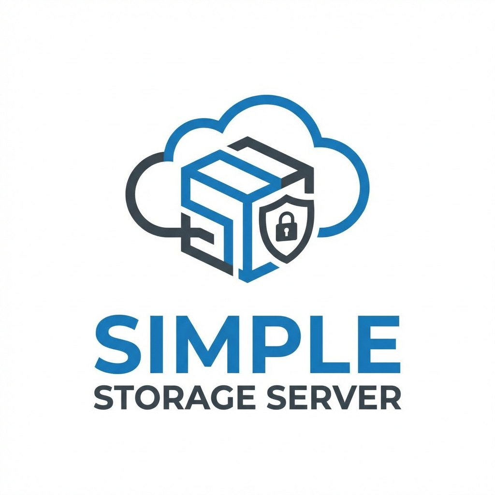

# Simple Storage Server

<p align="center">
  
</p>

<p align="center">
    <a href="https://laravel.com"></a>
    <a href="https://php.net"></a>
    <a href="https://c7.se"></a>
</p>

## Overview

**Simple Storage Server** is a high-performance, secure, and easy-to-deploy file storage solution built on **Laravel 12**, tailored for developers who need a reliable microservice for file management. It features a robust REST API, a modern dark-mode administrative dashboard, and automated file lifecycle management.

Whether you need a dedicated media server, a temporary file holding area, or a rigorous secure storage backend, Simple Storage Server provides the tools you need out of the box.

## 🚀 Features

- **🔒 Secure API**: Job-based and API-Key authenticated endpoints ensuring data integrity and security.
- **🛡️ Admin Dashboard**: A sleek, responsive, dark-mode interface for monitoring usage, managing files, and system configuration.
- **⏳ Auto-Cleanup**: Configurable retention policies to automatically remove old files, keeping storage costs low.
- **📊 Real-time Statistics**: Instant insights into disk usage, file counts, and traffic patterns.
- **📑 OpenAPI Documentation**: Fully interactive Swagger UI for seamless integration and testing.

## 🛠 Requirements

- **PHP**: 8.2 or higher
- **Composer**
- **Database**: SQLite (default), MySQL, or PostgreSQL
- **Node.js**: (Optional, for building frontend assets)

## 📦 Installation

1.  **Clone the repository**

    ```bash
    git clone <repository-url>
    cd simple-storage-server
    ```

2.  **Install Dependencies**

    ```bash
    composer install
    npm install && npm run build
    ```

3.  **Environment Setup**

    ```bash
    cp .env.example .env
    php artisan key:generate
    ```

    Configure your security settings in `.env`:

    ```env
    APP_URL=http://your-domain.com:5000
    STORAGE_API_KEY=your-secret-api-key
    ADMIN_USERNAME=admin
    ADMIN_PASSWORD=strong-password
    SWAGGER_PASSWORD=secret-docs-password
    ```

4.  **Database Migration**

    ```bash
    touch database/database.sqlite
    php artisan migrate --force
    ```

5.  **Deployment (Nginx + Supervisor)**

    This project is designed to be deployed manually on a Linux server (e.g., Ubuntu) at `/var/www/simple-storage-server`.

    **Step A: Nginx Configuration**
    1.  Copy the provided Nginx config:
        ```bash
        sudo cp deployment/nginx/simple-storage-server /etc/nginx/sites-available/
        ```
    2.  Edit it if necessary (e.g., update `server_name`):
        ```bash
        sudo nano /etc/nginx/sites-available/simple-storage-server
        ```
    3.  Enable the site:
        ```bash
        sudo ln -s /etc/nginx/sites-available/simple-storage-server /etc/nginx/sites-enabled/
        sudo nginx -t
        sudo systemctl reload nginx
        ```

    **Step B: Supervisor Configuration**
    1.  Install Supervisor:
        ```bash
        sudo apt-get install supervisor
        ```
    2.  Copy the provided Supervisor config:
        ```bash
        sudo cp deployment/supervisor/simple-storage-server.conf /etc/supervisor/conf.d/
        ```
    3.  Update Supervisor:
        ```bash
        sudo supervisorctl reread
        sudo supervisorctl update
        sudo supervisorctl start simple-storage-worker:*
        ```

    **Step C: Permissions**

    Ensure the web server user has access:

    ```bash
    sudo chown -R www-data:www-data /var/www/simple-storage-server
    sudo chmod -R 775 /var/www/simple-storage-server/storage /var/www/simple-storage-server/bootstrap/cache
    ```

## 📖 API Documentation

Scale your integration with confidence using our comprehensive API documentation.

- **Interactive Swagger UI**: [http://localhost:8000/api/documentation](http://localhost:8000/api/documentation)

_Note: The documentation is password-protected. Ensure you have set the `SWAGGER_PASSWORD` in your environment file._

### Key Endpoints

| Method   | Endpoint                 | Description                |
| :------- | :----------------------- | :------------------------- |
| `POST`   | `/api/upload`            | Securely upload a file.    |
| `GET`    | `/api/download/{job_id}` | Retrieve a stored file.    |
| `GET`    | `/api/check/{job_id}`    | Verify file existence.     |
| `DELETE` | `/api/delete/{job_id}`   | Permanently remove a file. |

## 🧪 Testing

Ensure stability with our test suite:

```bash
php artisan test
```

## 📄 License

This project is licensed under the [MIT License](LICENSE).
