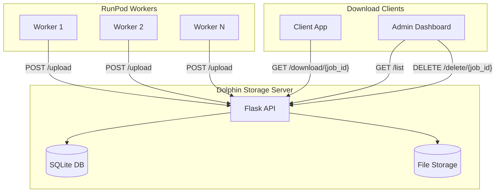
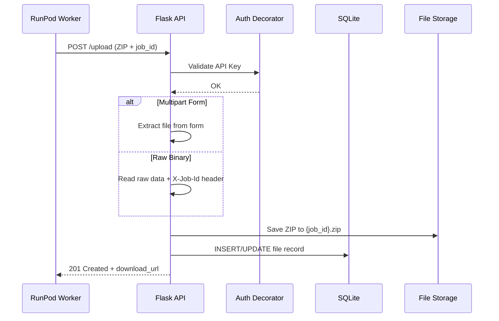
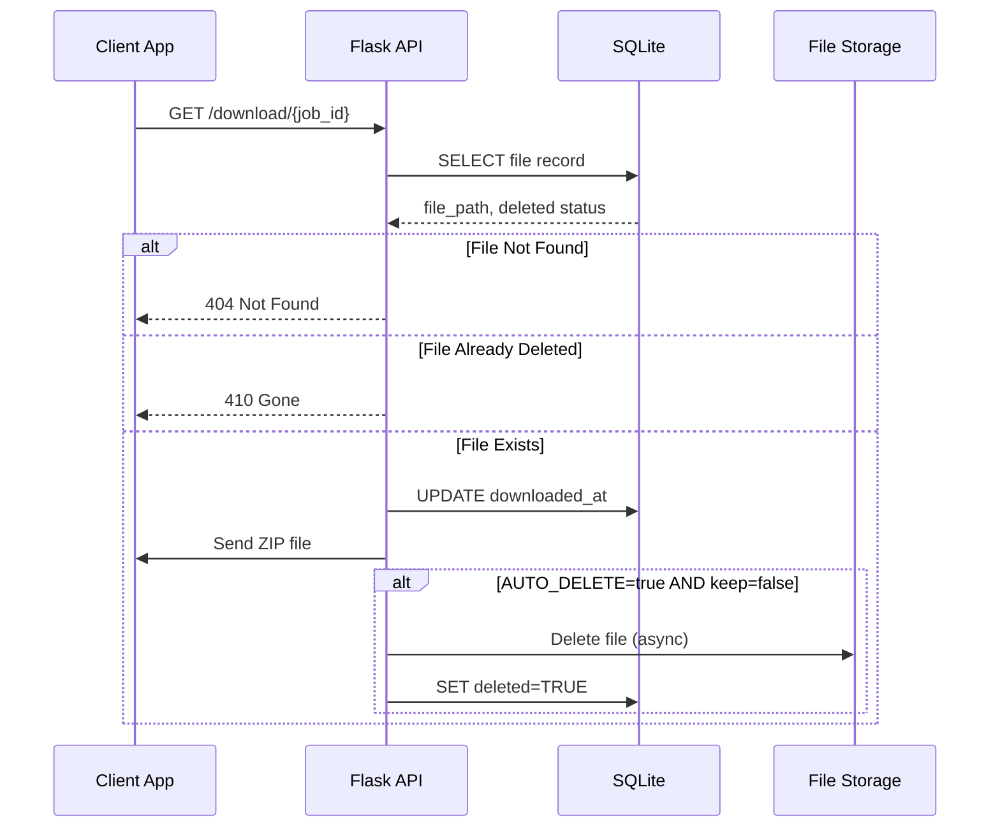
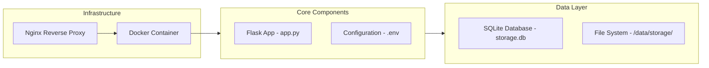
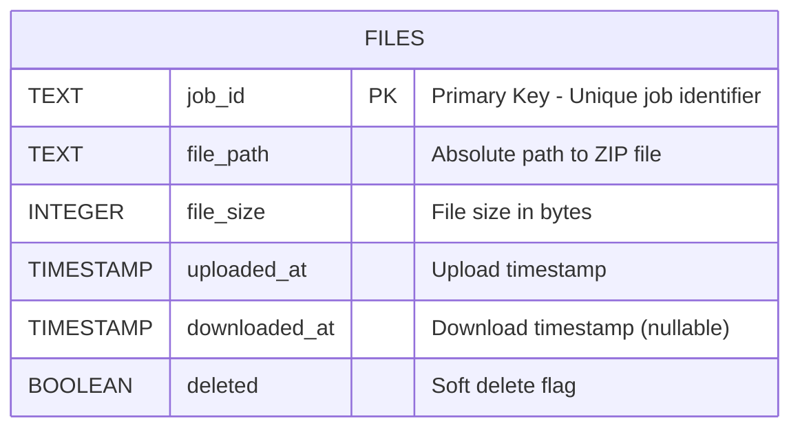
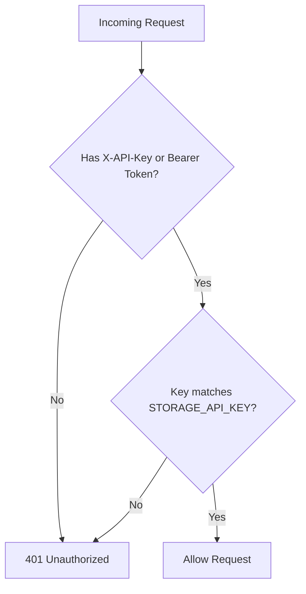
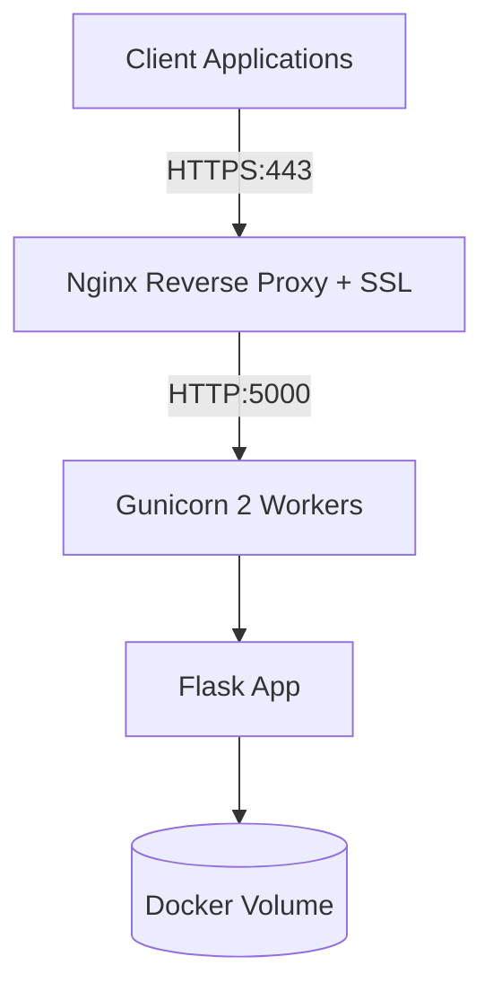
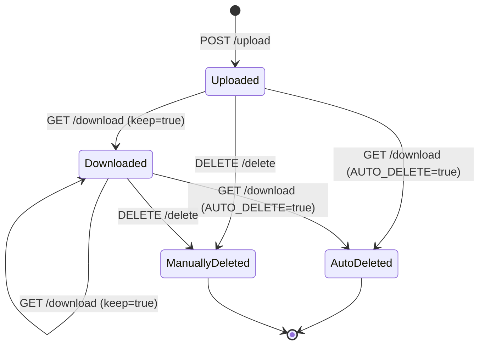

# Dolphin Storage Server - Architecture Documentation

A lightweight Flask-based file storage server designed as a fallback storage solution for RunPod workers processing PDF files.

## Overview

The Dolphin Storage Server provides a simple, secure, and ephemeral file storage for ZIP archives generated by RunPod workers. It's designed to be deployed on Hetzner or any VPS provider as a fallback storage when primary callback mechanisms fail.

---

## System Architecture



---

## Application Flow

### Upload Flow



### Download Flow



---

## Component Architecture



---

## API Endpoints

| Endpoint             | Method | Auth Required | Description                   |
| -------------------- | ------ | ------------- | ----------------------------- |
| `/health`            | GET    | ❌            | Health check endpoint         |
| `/upload`            | POST   | ✅            | Upload ZIP file with job_id   |
| `/download/{job_id}` | GET    | ✅            | Download ZIP file by job_id   |
| `/delete/{job_id}`   | DELETE | ✅            | Manually delete a file        |
| `/list`              | GET    | ✅            | List all stored files (admin) |

---

## Database Schema



---

## Authentication

The server uses API Key authentication. The key can be provided in two ways:

1. **X-API-Key Header**: `X-API-Key: your-api-key`
2. **Authorization Bearer Token**: `Authorization: Bearer your-api-key`



---

## Configuration

### Environment Variables

| Variable          | Default                             | Description                 |
| ----------------- | ----------------------------------- | --------------------------- |
| `STORAGE_API_KEY` | `change-me-in-production`           | API key for authentication  |
| `STORAGE_PATH`    | `./storage` / `/data/storage`       | Directory for ZIP files     |
| `DATABASE_PATH`   | `./storage.db` / `/data/storage.db` | SQLite database path        |
| `PORT`            | `5000`                              | Server listening port       |
| `AUTO_DELETE`     | `true`                              | Delete files after download |
| `DEBUG`           | `false`                             | Enable Flask debug mode     |

---

## Deployment Architecture



---

## File Lifecycle



---

## Error Handling

| Status Code        | Scenario                        |
| ------------------ | ------------------------------- |
| `200 OK`           | Successful download/delete/list |
| `201 Created`      | Successful upload               |
| `400 Bad Request`  | Missing job_id or file data     |
| `401 Unauthorized` | Invalid or missing API key      |
| `404 Not Found`    | Job not found or file missing   |
| `410 Gone`         | File already deleted            |

---

## Testing

The application includes a comprehensive test suite using pytest:

```bash
# Install test dependencies
pip install -r requirements.txt -r tests/requirements-test.txt

# Run tests
pytest tests/ -v

# Run with coverage
pytest tests/ --cov=app --cov-report=html
```

### Test Coverage

- **Health**: Health endpoint availability
- **Authentication**: API key validation for all protected endpoints
- **Upload**: Multipart form and raw binary uploads
- **Download**: File retrieval with keep/auto-delete options
- **Delete**: Manual file deletion
- **List**: Admin file listing

---

## Security Considerations

1. **API Key Protection**: Never commit API keys; use environment variables
2. **SSL/TLS**: Always deploy behind nginx with Let's Encrypt SSL
3. **Rate Limiting**: Consider adding rate limiting for production
4. **File Validation**: Consider adding file type/size validation
5. **Log Monitoring**: Monitor logs for unauthorized access attempts
